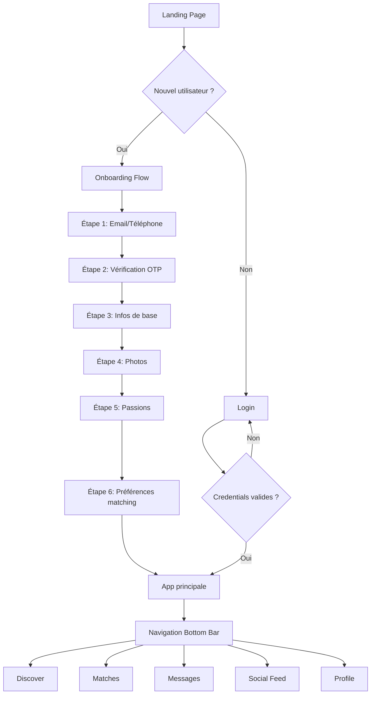

# Cahier des Charges - МойDate

**Version:** 1.0.0
**Date:** 2025-01-03
**Statut:** Architecture Frontend Complète + Spécifications Backend

---

## 📋 Table des Matières

1. [Introduction et Vision](#1-introduction-et-vision)
2. [Arborescence du Projet](#2-arborescence-du-projet)
3. [Architecture Modulaire Frontend](#3-architecture-modulaire-frontend)
4. [Architecture Modulaire Backend (Future)](#4-architecture-modulaire-backend-future)
5. [Sécurité - OWASP Top 10 2021](#5-sécurité---owasp-top-10-2021)
6. [Stack Technologique](#6-stack-technologique)
7. [Spécifications de l'Algorithme](#7-spécifications-de-lalgorithme)
8. [Indépendance des Modules](#8-indépendance-des-modules)
9. [Plans de Renforcement Futur](#9-plans-de-renforcement-futur)

---

## 1. Introduction et Vision

### 1.1 Concept МойDate

**МойDate** est une plateforme de rencontres hybride combinant :

- 💕 **Application de Dating Classique** : Swipe, matches, messagerie
- 📺 **Feed Social Type Télé-Réalité** : Narratives générées par l'algorithme commentant les comportements des utilisateurs de manière sarcastique, drôle et bienveillante

### 1.2 Proposition de Valeur Unique

```
МойDate = Tinder + Love Island + The Circle
```

**Ce qui nous différencie :**
- **Narratives algorithmiques** : L'algorithme observe et commente les comportements en temps réel
- **Biais interculturel 55%** : Promotion active des rencontres multiculturelles
- **Tracking de relations** : Questionnaires progressifs pour suivre l'évolution des couples
- **Social Feed gamifié** : Badges, achievements, leaderboard
- **Multilingue & Inclusif** : FR, EN, RU, PT + LGBTQ+ friendly

### 1.3 Ton de l'Algorithme

- **Sarcastique** : Punchlines humoristiques sur les comportements
- **Drôle** : Références pop culture, memes, jeux de mots
- **Romantique** : Encouragements pour les belles histoires
- **Bienveillant** : Jamais méchant, toujours positif
- **Sage** : Conseils légers sur la communication et les relations

### 1.4 Avertissement Sécurité

⚠️ **Disclaimer pour partages externes** :
> "МойDate est un espace sûr. Si vous partagez du contenu à l'extérieur (Instagram, TikTok, etc.), assurez-vous d'avoir le consentement des personnes concernées et de respecter leur vie privée."

---

## 2. Arborescence du Projet

### 2.1 Structure Actuelle (Frontend Complet)

```
love-network-hub/
├── src/
│   ├── features/                          # MODULES INDÉPENDANTS
│   │   ├── discover-modern/               # ✅ MODULE DISCOVER
│   │   │   ├── components/
│   │   │   │   ├── Discover.tsx           # Écran principal
│   │   │   │   ├── SwipeCard.tsx          # Carte draggable avec framer-motion
│   │   │   │   ├── ActionButtons.tsx      # Like/Skip/SuperLike
│   │   │   │   ├── ProfileModal.tsx       # Modal fullscreen avec carousel
│   │   │   │   └── FiltersSidebar.tsx     # Filtres (genre, distance, âge, vérifié)
│   │   │   ├── hooks/
│   │   │   │   ├── useSwipe.ts            # Logique swipe (touch + keyboard)
│   │   │   │   └── useDiscoverProfiles.ts # Gestion profils & filtres
│   │   │   ├── store/
│   │   │   │   └── userStats.ts           # Mock localStorage (likes, passes, superlikes)
│   │   │   ├── types/
│   │   │   │   └── index.ts               # Profile, SwipeAction, UserStats, Filters
│   │   │   └── index.ts                   # Export public
│   │   │
│   │   ├── matches-modern/                # ✅ MODULE MATCHES
│   │   │   ├── components/
│   │   │   │   ├── MatchesScreen.tsx      # Écran principal
│   │   │   │   ├── MatchCard.tsx          # Carte avec quick actions (hover)
│   │   │   │   ├── MatchPreviewModal.tsx  # Mini-modal avec infos rapides
│   │   │   │   ├── MatchesFilter.tsx      # Filtres (Tous, Nouveaux, Super-likes, Vérifiés)
│   │   │   │   └── SectionHeader.tsx      # En-têtes temporelles (Aujourd'hui, Hier, etc.)
│   │   │   ├── hooks/
│   │   │   │   └── useMatches.ts          # Gestion matches & filtres
│   │   │   ├── store/
│   │   │   │   └── matchesStore.ts        # Mock matches + groupement temporel
│   │   │   ├── types/
│   │   │   │   └── index.ts               # Match, MatchFilter, GroupedMatches
│   │   │   └── index.ts                   # Export public
│   │   │
│   │   ├── messages-modern/               # ✅ MODULE MESSAGES
│   │   │   ├── components/
│   │   │   │   ├── MessagesScreen.tsx     # Écran principal (liste conversations)
│   │   │   │   ├── SearchBar.tsx          # Recherche intelligente avec filtres
│   │   │   │   ├── ActivitiesBar.tsx      # Stories/statuts avec halos colorés
│   │   │   │   ├── ConversationListItem.tsx # Item swipeable (supprimer/favori)
│   │   │   │   ├── ConversationView.tsx   # Vue chat complète
│   │   │   │   ├── MessageBubble.tsx      # Bulle avec réactions rapides
│   │   │   │   └── MessageInput.tsx       # Input riche (texte/emoji/stickers/GIF/audio/images)
│   │   │   ├── hooks/
│   │   │   │   └── useMessages.ts         # Gestion conversations & messages
│   │   │   ├── store/
│   │   │   │   └── messagesStore.ts       # Mock conversations + messages
│   │   │   ├── types/
│   │   │   │   └── index.ts               # Conversation, Message, Activity
│   │   │   └── index.ts                   # Export public
│   │   │
│   │   ├── social-modern/                 # ✅ MODULE SOCIAL FEED
│   │   │   ├── components/
│   │   │   │   ├── SocialFeedScreen.tsx   # Écran principal avec toggle narratives
│   │   │   │   ├── NarrativesBar.tsx      # Barre horizontale stories narratives
│   │   │   │   ├── NarrativePost.tsx      # Post narrative distinct (gradient, 🎭)
│   │   │   │   └── UserPost.tsx           # Post utilisateur standard
│   │   │   ├── hooks/
│   │   │   │   └── useSocialFeed.ts       # Gestion feed, narratives, likes
│   │   │   ├── store/
│   │   │   │   └── socialStore.ts         # Mock posts + narratives
│   │   │   ├── data/
│   │   │   │   └── feed-narratives.json   # ⭐ 110 templates narratives enrichis
│   │   │   ├── types/
│   │   │   │   └── index.ts               # Post, Narrative, NarrativeCategory
│   │   │   └── index.ts                   # Export public
│   │   │
│   │   ├── profile/                       # MODULE PROFILE (existant)
│   │   ├── stories/                       # MODULE STORIES (existant)
│   │   ├── feed/                          # Ancien feed (legacy)
│   │   └── matches/                       # Ancien matches (legacy)
│   │
│   ├── components/                        # COMPOSANTS PARTAGÉS
│   │   ├── ui/                            # shadcn/ui components
│   │   ├── DatingApp.tsx                  # ⚙️ ROUTEUR PRINCIPAL
│   │   ├── Navigation.tsx                 # Navigation bottom bar
│   │   ├── ThemeToggle.tsx                # Dark mode toggle
│   │   ├── NotificationCenter.tsx         # Centre notifications
│   │   └── DebugPanel.tsx                 # Panel debug (dev only)
│   │
│   ├── hooks/                             # HOOKS GLOBAUX
│   │   ├── useAuth.ts                     # Authentication
│   │   ├── useMatching.ts                 # Matching logic
│   │   └── use-toast.ts                   # Toast notifications
│   │
│   ├── data/                              # DONNÉES MOCK GLOBALES
│   │   └── mockData.ts                    # Profils mock partagés
│   │
│   ├── lib/                               # UTILITAIRES
│   │   └── utils.ts                       # cn(), helpers
│   │
│   ├── assets/                            # ASSETS STATIQUES
│   │   └── hero-love.jpg
│   │
│   ├── App.tsx                            # Root component
│   ├── main.tsx                           # Entry point
│   └── index.css                          # Global styles + Tailwind
│
├── docs/                                  # 📚 DOCUMENTATION
│   ├── CAHIER_DES_CHARGES.md              # ⭐ CE DOCUMENT
│   └── BACKEND_TODO.md                    # ⭐ TODO liste backend complète
│
├── public/                                # Assets publics
├── package.json                           # Dependencies & scripts
├── tsconfig.json                          # TypeScript config
├── vite.config.ts                         # Vite config
├── tailwind.config.ts                     # Tailwind config
└── CLAUDE.md                              # Instructions Claude Code

```

### 2.2 Structure Backend Future (Microservices)

```
moydate-backend/
├── services/
│   ├── auth-service/                      # 🔐 SERVICE AUTHENTIFICATION
│   │   ├── src/
│   │   │   ├── controllers/
│   │   │   │   ├── authController.ts      # Login, register, verify
│   │   │   │   └── sessionController.ts   # Session management
│   │   │   ├── middleware/
│   │   │   │   ├── jwt.middleware.ts      # JWT validation
│   │   │   │   └── rateLimit.middleware.ts # Brute force protection
│   │   │   ├── models/
│   │   │   │   └── User.model.ts          # User schema
│   │   │   ├── services/
│   │   │   │   ├── emailService.ts        # Email verification
│   │   │   │   └── passwordService.ts     # Hashing (bcrypt)
│   │   │   └── routes/
│   │   │       └── auth.routes.ts
│   │   ├── tests/
│   │   ├── Dockerfile
│   │   ├── package.json
│   │   └── tsconfig.json
│   │
│   ├── profiles-service/                  # 👤 SERVICE PROFILS
│   │   ├── src/
│   │   │   ├── controllers/
│   │   │   │   ├── profileController.ts   # CRUD profils
│   │   │   │   └── preferencesController.ts # Préférences matching
│   │   │   ├── models/
│   │   │   │   ├── Profile.model.ts
│   │   │   │   └── Preferences.model.ts
│   │   │   ├── services/
│   │   │   │   ├── imageUploadService.ts  # Upload images (S3/CDN)
│   │   │   │   └── verificationService.ts # Vérification profil
│   │   │   └── routes/
│   │   │       └── profiles.routes.ts
│   │   ├── tests/
│   │   └── package.json
│   │
│   ├── matching-service/                  # 💕 SERVICE MATCHING
│   │   ├── src/
│   │   │   ├── algorithms/
│   │   │   │   ├── compatibilityScore.ts  # Calcul score compatibilité
│   │   │   │   ├── interculturalBoost.ts  # Biais interculturel 55%
│   │   │   │   └── astroCompatibility.ts  # Compatibilité astrologique
│   │   │   ├── controllers/
│   │   │   │   ├── swipeController.ts     # Like/pass/superlike
│   │   │   │   └── matchController.ts     # Gestion matches
│   │   │   ├── models/
│   │   │   │   ├── Swipe.model.ts
│   │   │   │   └── Match.model.ts
│   │   │   ├── services/
│   │   │   │   ├── discoveryService.ts    # Génération pile profils
│   │   │   │   └── notificationService.ts # Notif match
│   │   │   └── routes/
│   │   │       └── matching.routes.ts
│   │   ├── tests/
│   │   └── package.json
│   │
│   ├── messaging-service/                 # 💬 SERVICE MESSAGERIE
│   │   ├── src/
│   │   │   ├── controllers/
│   │   │   │   ├── conversationController.ts
│   │   │   │   └── messageController.ts
│   │   │   ├── models/
│   │   │   │   ├── Conversation.model.ts
│   │   │   │   └── Message.model.ts
│   │   │   ├── services/
│   │   │   │   ├── websocketService.ts    # WebSocket real-time
│   │   │   │   ├── translationService.ts  # Traduction auto
│   │   │   │   └── moderationService.ts   # Modération contenu
│   │   │   ├── websocket/
│   │   │   │   ├── messageHandlers.ts
│   │   │   │   └── typingIndicator.ts
│   │   │   └── routes/
│   │   │       └── messages.routes.ts
│   │   ├── tests/
│   │   └── package.json
│   │
│   ├── social-feed-service/               # 📺 SERVICE FEED SOCIAL
│   │   ├── src/
│   │   │   ├── algorithms/
│   │   │   │   ├── narrativeGenerator.ts  # ⭐ GÉNÉRATEUR NARRATIVES
│   │   │   │   ├── templateSelector.ts    # Sélection templates
│   │   │   │   └── toneCalibrator.ts      # Calibration ton (sarcastique/drôle)
│   │   │   ├── controllers/
│   │   │   │   ├── feedController.ts      # Timeline feed
│   │   │   │   ├── postController.ts      # Posts utilisateurs
│   │   │   │   ├── narrativeController.ts # Narratives algorithmiques
│   │   │   │   └── commentController.ts   # Commentaires
│   │   │   ├── models/
│   │   │   │   ├── Post.model.ts
│   │   │   │   ├── Narrative.model.ts
│   │   │   │   ├── Comment.model.ts
│   │   │   │   └── Reaction.model.ts
│   │   │   ├── services/
│   │   │   │   ├── behaviorAnalyzer.ts    # Analyse comportements users
│   │   │   │   ├── eventListener.ts       # Écoute events (swipes, matches)
│   │   │   │   └── shareService.ts        # Partages externes
│   │   │   ├── data/
│   │   │   │   └── narrative-templates.json # 110 templates
│   │   │   └── routes/
│   │   │       └── feed.routes.ts
│   │   ├── tests/
│   │   └── package.json
│   │
│   ├── gamification-service/              # 🎮 SERVICE GAMIFICATION
│   │   ├── src/
│   │   │   ├── controllers/
│   │   │   │   ├── badgeController.ts
│   │   │   │   ├── achievementController.ts
│   │   │   │   └── leaderboardController.ts
│   │   │   ├── models/
│   │   │   │   ├── Badge.model.ts
│   │   │   │   └── Achievement.model.ts
│   │   │   └── routes/
│   │   │       └── gamification.routes.ts
│   │   ├── tests/
│   │   └── package.json
│   │
│   ├── relationship-tracker-service/      # 📊 SERVICE TRACKING RELATIONS
│   │   ├── src/
│   │   │   ├── controllers/
│   │   │   │   ├── questionnaireController.ts
│   │   │   │   └── relationshipController.ts
│   │   │   ├── models/
│   │   │   │   ├── Questionnaire.model.ts
│   │   │   │   └── Relationship.model.ts
│   │   │   ├── services/
│   │   │   │   └── progressionService.ts  # Questionnaires progressifs
│   │   │   └── routes/
│   │   │       └── tracker.routes.ts
│   │   ├── tests/
│   │   └── package.json
│   │
│   ├── moderation-service/                # 🛡️ SERVICE MODÉRATION
│   │   ├── src/
│   │   │   ├── controllers/
│   │   │   │   ├── reportController.ts
│   │   │   │   └── reviewController.ts
│   │   │   ├── models/
│   │   │   │   └── Report.model.ts
│   │   │   ├── services/
│   │   │   │   ├── autoModeration.ts      # Modération auto (ML)
│   │   │   │   └── manualReview.ts        # Review manuelle
│   │   │   └── routes/
│   │   │       └── moderation.routes.ts
│   │   ├── tests/
│   │   └── package.json
│   │
│   └── notification-service/              # 🔔 SERVICE NOTIFICATIONS
│       ├── src/
│       │   ├── controllers/
│       │   │   └── notificationController.ts
│       │   ├── models/
│       │   │   └── Notification.model.ts
│       │   ├── services/
│       │   │   ├── pushService.ts         # Push notifications
│       │   │   ├── emailService.ts        # Email notifications
│       │   │   └── smsService.ts          # SMS notifications
│       │   └── routes/
│       │       └── notifications.routes.ts
│       ├── tests/
│       └── package.json
│
├── shared/                                # 📦 MODULES PARTAGÉS
│   ├── database/
│   │   ├── migrations/
│   │   ├── seeders/
│   │   └── config.ts
│   ├── middleware/
│   │   ├── cors.middleware.ts
│   │   ├── logger.middleware.ts
│   │   └── errorHandler.middleware.ts
│   ├── utils/
│   │   ├── validators.ts
│   │   ├── sanitizers.ts                  # DOMPurify, validator.js
│   │   └── helpers.ts
│   └── types/
│       └── common.types.ts
│
├── gateway/                               # 🌐 API GATEWAY
│   ├── src/
│   │   ├── routes/
│   │   │   └── index.ts                   # Routing vers microservices
│   │   ├── middleware/
│   │   │   ├── rateLimit.ts               # Rate limiting global
│   │   │   └── authentication.ts          # JWT validation
│   │   └── server.ts
│   └── package.json
│
├── docker-compose.yml                     # Orchestration services
├── .env.example                           # Variables d'environnement
└── README.md

```

---

## 3. Architecture Modulaire Frontend

### 3.1 Principes d'Architecture

**Chaque feature est un module COMPLÈTEMENT INDÉPENDANT :**

```typescript
feature-name/
├── components/      // Composants UI du feature (PRIVÉS sauf export explicite)
├── hooks/          // Hooks du feature (logique métier)
├── store/          // État local du feature (mock localStorage ou Zustand)
├── types/          // Types TypeScript du feature
├── data/           // Données statiques du feature (optionnel)
└── index.ts        // ⚙️ SEUL POINT D'EXPORT PUBLIC
```

### 3.2 Règles d'Indépendance

#### ✅ AUTORISÉ :

```typescript
// ✅ Import depuis le même feature
import { useSwipe } from '../hooks/useSwipe';
import { SwipeCard } from './SwipeCard';

// ✅ Import depuis composants UI partagés
import { Button } from '@/components/ui/button';

// ✅ Import depuis hooks globaux
import { useAuth } from '@/hooks/useAuth';

// ✅ Import depuis utils
import { cn } from '@/lib/utils';
```

#### ❌ INTERDIT :

```typescript
// ❌ Import direct depuis un autre feature
import { MatchCard } from '@/features/matches-modern/components/MatchCard';

// ❌ Import depuis store d'un autre feature
import { matchesStore } from '@/features/matches-modern/store/matchesStore';
```

### 3.3 Communication Inter-Modules

**Méthodes autorisées :**

1. **Via Composants UI Partagés** (`@/components/ui/`)
2. **Via Hooks Globaux** (`@/hooks/`)
3. **Via Props Callback** (parent → enfant)
4. **Via État Global** (futur: Zustand/Redux si nécessaire)
5. **Via LocalStorage/SessionStorage** (pour persistance)
6. **Via URL/Routing** (React Router)

**Exemple de communication correcte :**

```typescript
// DatingApp.tsx (Parent)
const [activeSection, setActiveSection] = useState<NavSection>('discover');

const renderContent = () => {
  switch (activeSection) {
    case 'discover':
      return <Discover />;
    case 'matches':
      return <MatchesScreen />;
    case 'messages':
      return <MessagesScreen />;
    case 'social':
      return <SocialFeedScreen />;
    default:
      return <Discover />;
  }
};

// Navigation.tsx (Enfant)
<Navigation
  activeSection={activeSection}
  onSectionChange={setActiveSection}
/>
```

### 3.4 Modules Frontend Actuels

#### **discover-modern** - Module Découverte
- **Responsabilité** : Swipe de profils, filtres, discovery stack
- **État** : `userStats` (localStorage) - likes, passes, superlikes
- **Hooks** : `useSwipe`, `useDiscoverProfiles`
- **Composants** : SwipeCard, ActionButtons, ProfileModal, FiltersSidebar
- **Dependencies** : Framer Motion (animations), Lucide (icons)

#### **matches-modern** - Module Matches
- **Responsabilité** : Gestion matches, preview, quick actions
- **État** : `matchesStore` (localStorage) - matches groupés par temps
- **Hooks** : `useMatches`
- **Composants** : MatchCard, MatchPreviewModal, MatchesFilter, SectionHeader
- **Dependencies** : Canvas-confetti (animations match)

#### **messages-modern** - Module Messagerie
- **Responsabilité** : Conversations, messages, rich input
- **État** : `messagesStore` (localStorage) - conversations + messages
- **Hooks** : `useMessages`
- **Composants** : SearchBar, ActivitiesBar, ConversationListItem, MessageBubble, MessageInput
- **Dependencies** : Framer Motion (swipe gestures), Lucide (icons)
- **Features** : Traduction, réactions, audio playback, typing indicator

#### **social-modern** - Module Feed Social
- **Responsabilité** : Feed posts + narratives algorithmiques
- **État** : `socialStore` (localStorage) - posts, narratives, likes/dislikes
- **Hooks** : `useSocialFeed`
- **Composants** : NarrativesBar, NarrativePost, UserPost
- **Data** : `feed-narratives.json` (110 templates)
- **Features** : Toggle narratives, like/dislike, share, gradients par catégorie

### 3.5 Design System 2025-2026

**Palette de Couleurs :**

```css
:root {
  /* Primary Colors */
  --color-love-primary: #ff6b4a;      /* Coral */
  --color-love-secondary: #0ba5e9;    /* Powder Blue */
  --color-love-accent: #5a9360;       /* Sage Green */

  /* Gradients */
  --gradient-primary: linear-gradient(135deg, #ff6b4a 0%, #f8b500 100%);
  --gradient-secondary: linear-gradient(135deg, #0ba5e9 0%, #667eea 100%);

  /* Dark Mode */
  --bg-dark: #1a1715;                 /* Warm Gray */
  --card-dark: rgba(26, 23, 21, 0.8); /* Glassmorphism */
}
```

**Glassmorphism Pattern :**

```tsx
<div className="bg-white/80 dark:bg-gray-900/80 backdrop-blur-md border border-border/50">
  {/* Content */}
</div>
```

**Animations :**

```typescript
// Framer Motion Spring Config
const springConfig = { stiffness: 300, damping: 30 };

<motion.div
  initial={{ opacity: 0, y: 20 }}
  animate={{ opacity: 1, y: 0 }}
  exit={{ opacity: 0, y: -20 }}
  transition={{ duration: 0.3, ease: "easeOut" }}
>
```

### 3.6 Gestion d'État

**Actuel (localStorage) :**

```typescript
// Pattern utilisé dans tous les stores
export const getUserStats = (): UserStats => {
  const stored = localStorage.getItem('moydate_user_stats');
  return stored ? JSON.parse(stored) : defaultStats;
};

export const saveUserStats = (stats: UserStats): void => {
  localStorage.setItem('moydate_user_stats', JSON.stringify(stats));
};
```

**Futur (Backend API) :**

```typescript
// API client pattern recommandé
export const apiClient = {
  async getLikes(userId: string): Promise<Like[]> {
    const response = await fetch(`/api/users/${userId}/likes`, {
      headers: { 'Authorization': `Bearer ${token}` }
    });
    return response.json();
  },

  async createLike(profileId: string): Promise<SwipeResult> {
    const response = await fetch(`/api/swipes/like`, {
      method: 'POST',
      headers: { 'Content-Type': 'application/json' },
      body: JSON.stringify({ profileId })
    });
    return response.json();
  }
};
```

---

## 4. Architecture Modulaire Backend (Future)

### 4.1 Approche Microservices

**Chaque service backend est INDÉPENDANT :**

- ✅ Base de données dédiée (ou schéma isolé)
- ✅ API REST propre
- ✅ Tests unitaires/intégration isolés
- ✅ Déployable séparément (Docker)
- ✅ Scalable indépendamment
- ✅ Équipe dédiée possible

### 4.2 Communication Inter-Services

**Méthodes recommandées :**

1. **REST API** (synchrone)
   ```
   messaging-service → profiles-service
   GET /api/profiles/:id
   ```

2. **Message Queue** (asynchrone)
   ```
   matching-service → notification-service
   Event: "NEW_MATCH" { userId, matchId }
   ```

3. **API Gateway** (routage centralisé)
   ```
   Client → Gateway → matching-service
                   → messaging-service
                   → social-feed-service
   ```

4. **gRPC** (pour haute performance)
   ```
   social-feed-service ⇄ matching-service (behavior analysis)
   ```

### 4.3 Stack Backend Recommandée

#### **Node.js + TypeScript + Express**

**Avantages :**
- Même langage que frontend (TypeScript)
- Écosystème riche (npm)
- Excellentes performances I/O
- WebSocket natif (Socket.io)
- Large communauté

**Structure Service Type :**

```typescript
// src/server.ts
import express from 'express';
import cors from 'cors';
import helmet from 'helmet';
import rateLimit from 'express-rate-limit';

const app = express();

// Security middleware
app.use(helmet());
app.use(cors({ origin: process.env.ALLOWED_ORIGINS }));
app.use(express.json({ limit: '10mb' }));

// Rate limiting
const limiter = rateLimit({
  windowMs: 15 * 60 * 1000, // 15 minutes
  max: 100, // limit each IP to 100 requests per windowMs
});
app.use('/api/', limiter);

// Routes
app.use('/api/auth', authRoutes);
app.use('/api/profiles', profileRoutes);

// Error handler
app.use(errorHandler);

app.listen(process.env.PORT || 3000);
```

#### **Base de Données : PostgreSQL**

**Avantages :**
- Relations complexes (matches, conversations)
- ACID transactions
- JSON support (profils flexibles)
- Full-text search
- Mature et performant

**Exemple Schema :**

```sql
-- Table Users (auth-service)
CREATE TABLE users (
  id UUID PRIMARY KEY DEFAULT gen_random_uuid(),
  email VARCHAR(255) UNIQUE NOT NULL,
  password_hash VARCHAR(255) NOT NULL,
  email_verified BOOLEAN DEFAULT FALSE,
  created_at TIMESTAMP DEFAULT NOW(),
  updated_at TIMESTAMP DEFAULT NOW()
);

-- Table Profiles (profiles-service)
CREATE TABLE profiles (
  id UUID PRIMARY KEY DEFAULT gen_random_uuid(),
  user_id UUID REFERENCES users(id) ON DELETE CASCADE,
  first_name VARCHAR(100) NOT NULL,
  date_of_birth DATE NOT NULL,
  gender VARCHAR(20),
  bio TEXT,
  profile_images TEXT[], -- Array of URLs
  verified BOOLEAN DEFAULT FALSE,
  location POINT, -- PostGIS for geolocation
  created_at TIMESTAMP DEFAULT NOW(),
  updated_at TIMESTAMP DEFAULT NOW()
);

-- Table Swipes (matching-service)
CREATE TABLE swipes (
  id UUID PRIMARY KEY DEFAULT gen_random_uuid(),
  user_id UUID REFERENCES users(id),
  target_profile_id UUID REFERENCES profiles(id),
  action VARCHAR(20) NOT NULL, -- 'like', 'pass', 'superlike'
  created_at TIMESTAMP DEFAULT NOW(),
  UNIQUE(user_id, target_profile_id)
);

-- Table Matches (matching-service)
CREATE TABLE matches (
  id UUID PRIMARY KEY DEFAULT gen_random_uuid(),
  user1_id UUID REFERENCES users(id),
  user2_id UUID REFERENCES users(id),
  matched_at TIMESTAMP DEFAULT NOW(),
  CHECK (user1_id < user2_id), -- Avoid duplicates
  UNIQUE(user1_id, user2_id)
);

-- Table Messages (messaging-service)
CREATE TABLE messages (
  id UUID PRIMARY KEY DEFAULT gen_random_uuid(),
  conversation_id UUID REFERENCES conversations(id),
  sender_id UUID REFERENCES users(id),
  content TEXT NOT NULL,
  type VARCHAR(20) DEFAULT 'text', -- 'text', 'image', 'audio', 'video'
  media_url TEXT,
  translated BOOLEAN DEFAULT FALSE,
  read_at TIMESTAMP,
  created_at TIMESTAMP DEFAULT NOW()
);

-- Table Feed Posts (social-feed-service)
CREATE TABLE feed_posts (
  id UUID PRIMARY KEY DEFAULT gen_random_uuid(),
  user_id UUID REFERENCES users(id),
  type VARCHAR(20) NOT NULL, -- 'date', 'match', 'milestone'
  content TEXT,
  media_urls TEXT[],
  visibility VARCHAR(20) DEFAULT 'public', -- 'public', 'matches_only', 'private'
  likes_count INTEGER DEFAULT 0,
  comments_count INTEGER DEFAULT 0,
  created_at TIMESTAMP DEFAULT NOW()
);

-- Table Narratives (social-feed-service) ⭐
CREATE TABLE narratives_generated (
  id UUID PRIMARY KEY DEFAULT gen_random_uuid(),
  template_id VARCHAR(50) NOT NULL,
  category VARCHAR(50) NOT NULL, -- 'sarcastic', 'funny', 'romantic', 'wisdom'
  content TEXT NOT NULL,
  variables JSONB, -- Variables utilisées pour générer
  target_users UUID[], -- Users concernés
  likes_count INTEGER DEFAULT 0,
  dislikes_count INTEGER DEFAULT 0,
  shares_count INTEGER DEFAULT 0,
  created_at TIMESTAMP DEFAULT NOW(),
  INDEX idx_category (category),
  INDEX idx_created_at (created_at DESC)
);
```

#### **Cache : Redis**

**Utilisation :**
- Session storage (JWT refresh tokens)
- Rate limiting counters
- Profils fréquemment consultés
- File d'attente messages (Bull)
- Pub/Sub pour WebSocket

```typescript
// Example Redis usage
import Redis from 'ioredis';

const redis = new Redis(process.env.REDIS_URL);

// Cache profile
await redis.setex(`profile:${profileId}`, 3600, JSON.stringify(profile));

// Rate limiting
const requestCount = await redis.incr(`ratelimit:${userId}:${Date.now()}`);
```

#### **File Storage : AWS S3 / Cloudinary**

**Pour :**
- Photos de profil
- Images de posts
- Vidéos/audio messages
- Fichiers média narratives

#### **WebSocket : Socket.io**

**Pour :**
- Messages temps réel
- Typing indicators
- Notifications instantanées
- Statuts online/offline

```typescript
// messaging-service/websocket/messageHandlers.ts
import { Server } from 'socket.io';

export const setupMessageHandlers = (io: Server) => {
  io.on('connection', (socket) => {
    const userId = socket.handshake.auth.userId;

    // Join user's room
    socket.join(`user:${userId}`);

    // Handle new message
    socket.on('send_message', async (data) => {
      const message = await saveMessage(data);
      // Emit to recipient
      io.to(`user:${data.recipientId}`).emit('new_message', message);
    });

    // Typing indicator
    socket.on('typing_start', (conversationId) => {
      socket.to(`conversation:${conversationId}`).emit('user_typing', userId);
    });
  });
};
```

### 4.4 Service Social Feed - Détails

**Responsabilité principale : GÉNÉRATION DE NARRATIVES**

#### **Algorithme de Génération :**

```typescript
// algorithms/narrativeGenerator.ts

interface BehaviorEvent {
  type: 'swipe' | 'match' | 'message' | 'profile_update';
  userId: string;
  data: any;
  timestamp: Date;
}

class NarrativeGenerator {

  /**
   * Analyser les événements et générer des narratives
   */
  async generateNarratives(events: BehaviorEvent[]): Promise<Narrative[]> {
    const narratives: Narrative[] = [];

    // 1. Analyser patterns de comportement
    const patterns = this.analyzeBehaviorPatterns(events);

    // 2. Sélectionner templates appropriés
    for (const pattern of patterns) {
      const template = await this.selectTemplate(pattern);
      if (template) {
        const narrative = await this.fillTemplate(template, pattern);
        narratives.push(narrative);
      }
    }

    // 3. Filtrer et prioriser
    return this.prioritizeNarratives(narratives);
  }

  /**
   * Détection de patterns
   */
  private analyzeBehaviorPatterns(events: BehaviorEvent[]): Pattern[] {
    const patterns: Pattern[] = [];

    // Pattern: Serial Swiper
    const swipesByUser = this.groupBy(events, e => e.userId);
    for (const [userId, userEvents] of swipesByUser) {
      const swipeCount = userEvents.filter(e => e.type === 'swipe').length;
      if (swipeCount > 50) {
        patterns.push({
          type: 'serial_swiper',
          userId,
          data: { swipeCount },
          priority: 'high'
        });
      }
    }

    // Pattern: Type Hunter (like toujours même type)
    // Pattern: No Match Yet (beaucoup de likes, pas de match)
    // Pattern: Intercultural Match (nouveau match interculturel)
    // ... etc

    return patterns;
  }

  /**
   * Sélection de template
   */
  private async selectTemplate(pattern: Pattern): Promise<Template | null> {
    const templates = await this.loadTemplates();

    // Filtrer par type
    const candidates = templates.filter(t => t.type === pattern.type);

    // Sélection aléatoire pondérée par catégorie
    const category = this.selectCategory(); // sarcastic, funny, romantic, wisdom
    const categoryTemplates = candidates.filter(t => t.category === category);

    if (categoryTemplates.length === 0) return null;

    // Random selection
    return categoryTemplates[Math.floor(Math.random() * categoryTemplates.length)];
  }

  /**
   * Remplir template avec données
   */
  private async fillTemplate(template: Template, pattern: Pattern): Promise<Narrative> {
    let content = template.template;

    // Récupérer données utilisateur
    const user = await this.getUser(pattern.userId);

    // Remplacer variables
    content = content.replace('{username}', user.firstName);
    content = content.replace('{age}', String(user.age));
    content = content.replace('{sign}', user.astroSign || '');
    content = content.replace('{like_count}', String(pattern.data.swipeCount || 0));
    // ... autres variables

    return {
      id: generateId(),
      templateId: template.id,
      category: template.category,
      content,
      variables: pattern.data,
      targetUsers: [pattern.userId],
      gradient: template.gradient,
      likes: 0,
      dislikes: 0,
      shares: 0,
      createdAt: new Date()
    };
  }

  /**
   * Calibration du ton
   */
  private selectCategory(): NarrativeCategory {
    // Distribution : 40% sarcastic, 30% funny, 20% romantic, 10% wisdom
    const rand = Math.random();
    if (rand < 0.4) return 'sarcastic';
    if (rand < 0.7) return 'funny';
    if (rand < 0.9) return 'romantic';
    return 'wisdom';
  }
}
```

#### **Event Listener (écoute autres services) :**

```typescript
// services/eventListener.ts

import { EventEmitter } from 'events';

class SocialFeedEventListener {

  constructor(private messageQueue: MessageQueue) {
    this.setupListeners();
  }

  /**
   * Écouter événements des autres services
   */
  private setupListeners() {

    // Écouter events du matching-service
    this.messageQueue.subscribe('matching.swipe.created', async (event) => {
      await this.handleSwipeEvent(event);
    });

    this.messageQueue.subscribe('matching.match.created', async (event) => {
      await this.handleMatchEvent(event);
    });

    // Écouter events du messaging-service
    this.messageQueue.subscribe('messaging.message.sent', async (event) => {
      await this.handleMessageEvent(event);
    });

    // Écouter events du profiles-service
    this.messageQueue.subscribe('profiles.photo.added', async (event) => {
      await this.handlePhotoEvent(event);
    });
  }

  private async handleSwipeEvent(event: SwipeEvent) {
    // Analyser si ce swipe mérite une narrative
    const shouldGenerate = await this.checkNarrativeThreshold(event.userId);

    if (shouldGenerate) {
      const narrative = await narrativeGenerator.generate({
        type: 'swipe',
        userId: event.userId,
        data: event
      });

      await this.saveAndBroadcast(narrative);
    }
  }

  private async handleMatchEvent(event: MatchEvent) {
    // Vérifier si match interculturel
    const isIntercultural = await this.checkIntercultural(
      event.user1Id,
      event.user2Id
    );

    if (isIntercultural) {
      const narrative = await narrativeGenerator.generate({
        type: 'intercultural_match',
        userId: event.user1Id,
        data: { ...event, isIntercultural: true }
      });

      await this.saveAndBroadcast(narrative);
    }
  }
}
```

### 4.5 Indépendance des Services Backend

**Principe :** Si un service tombe, les autres continuent de fonctionner.

**Stratégies :**

1. **Circuit Breaker Pattern**
   ```typescript
   // Si social-feed-service est down, matching continue de fonctionner
   try {
     await socialFeedClient.notifySwipe(swipeData);
   } catch (error) {
     logger.error('Social feed service unavailable', error);
     // Continue anyway, queue event for retry
     await messageQueue.publish('social.swipe.retry', swipeData);
   }
   ```

2. **Message Queue avec Retry**
   ```typescript
   // Bull queue with exponential backoff
   const queue = new Queue('narratives', {
     defaultJobOptions: {
       attempts: 3,
       backoff: {
         type: 'exponential',
         delay: 2000
       }
     }
   });
   ```

3. **Health Checks**
   ```typescript
   // Chaque service expose /health endpoint
   app.get('/health', (req, res) => {
     const health = {
       service: 'matching-service',
       status: 'healthy',
       uptime: process.uptime(),
       database: databaseConnected ? 'connected' : 'disconnected',
       redis: redisConnected ? 'connected' : 'disconnected'
     };
     res.json(health);
   });
   ```

4. **API Gateway avec Fallbacks**
   ```typescript
   // Gateway route avec timeout et fallback
   app.get('/api/feed', async (req, res) => {
     try {
       const response = await axios.get('http://social-feed-service/api/feed', {
         timeout: 5000
       });
       res.json(response.data);
     } catch (error) {
       // Fallback: renvoyer feed en cache
       const cachedFeed = await redis.get('feed:cached');
       res.json(cachedFeed || []);
     }
   });
   ```

---

## 5. Sécurité - OWASP Top 10 2021

### 5.1 A01:2021 – Broken Access Control

**Risque :** Utilisateur accède à données d'autres utilisateurs.

**Mesures :**

```typescript
// Middleware validation ownership
export const validateOwnership = async (req, res, next) => {
  const { userId } = req.params;
  const authenticatedUserId = req.user.id;

  if (userId !== authenticatedUserId) {
    return res.status(403).json({ error: 'Forbidden' });
  }

  next();
};

// Route avec validation
app.get('/api/profiles/:userId',
  authenticateJWT,
  validateOwnership,
  profileController.getProfile
);
```

**Frontend :**
```typescript
// Ne jamais exposer userId dans URL si sensible
// ✅ Correct
GET /api/me/profile

// ❌ Éviter
GET /api/profiles/user-123
```

### 5.2 A02:2021 – Cryptographic Failures

**Risque :** Données sensibles non chiffrées.

**Mesures :**

```typescript
// Password hashing avec bcrypt
import bcrypt from 'bcrypt';

export const hashPassword = async (password: string): Promise<string> => {
  const saltRounds = 12;
  return bcrypt.hash(password, saltRounds);
};

export const verifyPassword = async (
  password: string,
  hash: string
): Promise<boolean> => {
  return bcrypt.compare(password, hash);
};

// HTTPS obligatoire
if (process.env.NODE_ENV === 'production' && !req.secure) {
  return res.redirect('https://' + req.headers.host + req.url);
}

// Cookies sécurisés
res.cookie('session', token, {
  httpOnly: true,
  secure: true, // HTTPS only
  sameSite: 'strict',
  maxAge: 24 * 60 * 60 * 1000 // 24h
});
```

### 5.3 A03:2021 – Injection (XSS, SQL)

**Risque :** Injection de code malveillant.

**Mesures :**

```typescript
// SQL Injection Prevention (ORM Parameterized Queries)
import { Pool } from 'pg';

const pool = new Pool();

// ✅ Correct (parameterized)
const result = await pool.query(
  'SELECT * FROM users WHERE email = $1',
  [email]
);

// ❌ JAMAIS faire ça
const result = await pool.query(
  `SELECT * FROM users WHERE email = '${email}'`
);

// XSS Prevention (sanitize input)
import DOMPurify from 'isomorphic-dompurify';
import validator from 'validator';

export const sanitizeInput = (input: string): string => {
  // Escape HTML
  let clean = validator.escape(input);
  // Remove dangerous tags
  clean = DOMPurify.sanitize(clean);
  return clean;
};

// Validation
import Joi from 'joi';

const profileSchema = Joi.object({
  firstName: Joi.string().min(1).max(100).required(),
  bio: Joi.string().max(500).allow(''),
  age: Joi.number().integer().min(18).max(120).required()
});

export const validateProfile = (data: any) => {
  const { error, value } = profileSchema.validate(data);
  if (error) throw new ValidationError(error.details);
  return value;
};
```

**Frontend :**
```typescript
// React échappe automatiquement JSX
<div>{userInput}</div> // Safe

// ⚠️ Attention avec dangerouslySetInnerHTML
<div dangerouslySetInnerHTML={{ __html: DOMPurify.sanitize(userInput) }} />
```

### 5.4 A04:2021 – Insecure Design

**Risque :** Architecture mal conçue.

**Mesures :**

- ✅ Rate limiting sur toutes les routes
- ✅ Principle of Least Privilege (permissions minimales)
- ✅ Fail securely (erreur = accès refusé par défaut)
- ✅ Separation of duties (admin ≠ user)
- ✅ Defense in depth (plusieurs couches de sécurité)

### 5.5 A05:2021 – Security Misconfiguration

**Risque :** Configuration par défaut non sécurisée.

**Mesures :**

```typescript
// Helmet.js (security headers)
import helmet from 'helmet';

app.use(helmet({
  contentSecurityPolicy: {
    directives: {
      defaultSrc: ["'self'"],
      styleSrc: ["'self'", "'unsafe-inline'"],
      scriptSrc: ["'self'"],
      imgSrc: ["'self'", "data:", "https:"],
    }
  },
  hsts: {
    maxAge: 31536000,
    includeSubDomains: true,
    preload: true
  }
}));

// CORS strict
import cors from 'cors';

app.use(cors({
  origin: process.env.ALLOWED_ORIGINS.split(','),
  credentials: true,
  methods: ['GET', 'POST', 'PUT', 'DELETE'],
  allowedHeaders: ['Content-Type', 'Authorization']
}));

// Pas de stack traces en production
if (process.env.NODE_ENV === 'production') {
  app.use((err, req, res, next) => {
    res.status(500).json({ error: 'Internal server error' });
  });
} else {
  app.use((err, req, res, next) => {
    res.status(500).json({ error: err.message, stack: err.stack });
  });
}
```

### 5.6 A06:2021 – Vulnerable and Outdated Components

**Risque :** Dépendances avec vulnérabilités connues.

**Mesures :**

```bash
# Audit régulier
npm audit
npm audit fix

# Automated updates (Dependabot, Renovate)
# .github/dependabot.yml
version: 2
updates:
  - package-ecosystem: "npm"
    directory: "/"
    schedule:
      interval: "weekly"
```

### 5.7 A07:2021 – Identification and Authentication Failures

**Risque :** Authentification faible.

**Mesures :**

```typescript
// JWT avec refresh tokens
import jwt from 'jsonwebtoken';

export const generateTokens = (userId: string) => {
  const accessToken = jwt.sign(
    { userId },
    process.env.JWT_ACCESS_SECRET!,
    { expiresIn: '15m' }
  );

  const refreshToken = jwt.sign(
    { userId },
    process.env.JWT_REFRESH_SECRET!,
    { expiresIn: '7d' }
  );

  return { accessToken, refreshToken };
};

// Rate limiting login attempts
import rateLimit from 'express-rate-limit';

const loginLimiter = rateLimit({
  windowMs: 15 * 60 * 1000, // 15 minutes
  max: 5, // max 5 attempts
  message: 'Too many login attempts, please try again later'
});

app.post('/api/auth/login', loginLimiter, authController.login);

// Password requirements
const passwordSchema = Joi.string()
  .min(8)
  .pattern(/^(?=.*[a-z])(?=.*[A-Z])(?=.*\d)(?=.*[@$!%*?&])/)
  .required()
  .messages({
    'string.pattern.base': 'Password must contain uppercase, lowercase, number, and special character'
  });

// Email verification required
export const requireEmailVerified = (req, res, next) => {
  if (!req.user.emailVerified) {
    return res.status(403).json({ error: 'Email verification required' });
  }
  next();
};
```

### 5.8 A08:2021 – Software and Data Integrity Failures

**Risque :** Code ou données altérées.

**Mesures :**

```typescript
// Signature des payloads critiques
import crypto from 'crypto';

export const signPayload = (payload: any, secret: string): string => {
  const hmac = crypto.createHmac('sha256', secret);
  hmac.update(JSON.stringify(payload));
  return hmac.digest('hex');
};

export const verifyPayload = (
  payload: any,
  signature: string,
  secret: string
): boolean => {
  const expectedSignature = signPayload(payload, secret);
  return crypto.timingSafeEqual(
    Buffer.from(signature),
    Buffer.from(expectedSignature)
  );
};

// Subresource Integrity (CDN)
<script
  src="https://cdn.example.com/script.js"
  integrity="sha384-oqVuAfXRKap7fdgcCY5uykM6+R9GqQ8K/uxy9rx7HNQlGYl1kPzQho1wx4JwY8wC"
  crossorigin="anonymous"
></script>
```

### 5.9 A09:2021 – Security Logging and Monitoring Failures

**Risque :** Attaques non détectées.

**Mesures :**

```typescript
// Winston logger
import winston from 'winston';

const logger = winston.createLogger({
  level: 'info',
  format: winston.format.json(),
  transports: [
    new winston.transports.File({ filename: 'error.log', level: 'error' }),
    new winston.transports.File({ filename: 'combined.log' })
  ]
});

// Log security events
export const logSecurityEvent = (event: string, details: any) => {
  logger.warn('SECURITY_EVENT', {
    event,
    details,
    timestamp: new Date().toISOString(),
    ip: details.ip,
    userId: details.userId
  });
};

// Exemples d'événements à logger
- Failed login attempts
- Password changes
- Profile deletions
- Admin actions
- Rate limit hits
- Permission denials

// Alerting (Sentry, Datadog)
import * as Sentry from '@sentry/node';

Sentry.init({
  dsn: process.env.SENTRY_DSN,
  environment: process.env.NODE_ENV
});

app.use(Sentry.Handlers.errorHandler());
```

### 5.10 A10:2021 – Server-Side Request Forgery (SSRF)

**Risque :** Serveur fait des requêtes malveillantes.

**Mesures :**

```typescript
// Whitelist URLs autorisées
const ALLOWED_HOSTS = [
  'api.moydate.com',
  's3.amazonaws.com',
  'cdn.moydate.com'
];

export const validateUrl = (url: string): boolean => {
  try {
    const parsed = new URL(url);
    return ALLOWED_HOSTS.includes(parsed.hostname);
  } catch {
    return false;
  }
};

// Bloquer IPs privées
const BLOCKED_IP_RANGES = [
  /^127\./,        // localhost
  /^10\./,         // private
  /^172\.(1[6-9]|2[0-9]|3[01])\./, // private
  /^192\.168\./    // private
];

export const isPrivateIP = (ip: string): boolean => {
  return BLOCKED_IP_RANGES.some(range => range.test(ip));
};
```

---

## 6. Stack Technologique

### 6.1 Frontend (Actuel)

| Technologie | Version | Usage |
|------------|---------|-------|
| **React** | 18.3.1 | Framework UI |
| **TypeScript** | 5.6.2 | Typage statique |
| **Vite** | 6.0.11 | Build tool |
| **Tailwind CSS** | 3.4.17 | Styling |
| **Framer Motion** | 11.15.0 | Animations |
| **React Router** | 7.1.3 | Routing |
| **Lucide React** | 0.468.0 | Icons |
| **next-themes** | 0.4.4 | Dark mode |
| **canvas-confetti** | 1.9.3 | Confetti animations |
| **Radix UI** | - | Accessible components |

### 6.2 Backend (Recommandé)

| Technologie | Version | Usage |
|------------|---------|-------|
| **Node.js** | 20 LTS | Runtime JavaScript |
| **TypeScript** | 5.x | Typage statique backend |
| **Express** | 4.x | Framework web |
| **PostgreSQL** | 16.x | Base de données principale |
| **Redis** | 7.x | Cache & sessions |
| **Socket.io** | 4.x | WebSocket temps réel |
| **JWT** | 9.x | Authentification tokens |
| **bcrypt** | 5.x | Hashing passwords |
| **Bull** | 4.x | Job queues |
| **Joi** | 17.x | Validation schemas |
| **Winston** | 3.x | Logging |
| **Helmet** | 7.x | Security headers |
| **DOMPurify** | 3.x | Sanitization XSS |
| **AWS SDK** | 3.x | S3, SES, etc. |

### 6.3 DevOps

| Technologie | Usage |
|------------|-------|
| **Docker** | Containerisation services |
| **Docker Compose** | Orchestration locale |
| **Nginx** | Reverse proxy |
| **GitHub Actions** | CI/CD |
| **Jest** | Tests unitaires |
| **Supertest** | Tests API |
| **ESLint** | Linting |
| **Prettier** | Code formatting |
| **Husky** | Git hooks |

### 6.4 Infrastructure (Production)

| Service | Provider | Usage |
|---------|----------|-------|
| **Hosting Backend** | AWS EC2 / Heroku / Railway | Services Node.js |
| **Database** | AWS RDS / Supabase | PostgreSQL managé |
| **Cache** | AWS ElastiCache / Upstash | Redis managé |
| **File Storage** | AWS S3 / Cloudinary | Images/vidéos |
| **CDN** | CloudFront / Cloudflare | Distribution assets |
| **Email** | AWS SES / SendGrid | Emails transactionnels |
| **Monitoring** | Datadog / Sentry | Logs, errors, APM |
| **DNS** | Cloudflare | DNS + DDoS protection |

---

## 7. Spécifications de l'Algorithme

### 7.1 Objectifs de l'Algorithme МойDate

1. **Matching intelligent avec biais interculturel 55%**
2. **Génération de narratives en temps réel**
3. **Tracking évolution des relations**
4. **Gamification bienveillante**

### 7.2 Algorithme de Matching

#### **Score de Compatibilité (0-100) :**

```typescript
interface CompatibilityFactors {
  astrology: number;        // 0-20 points
  interests: number;        // 0-20 points
  location: number;         // 0-15 points
  intercultural: number;    // 0-25 points (BOOSTED)
  activity: number;         // 0-10 points
  verification: number;     // 0-10 points
}

const calculateCompatibility = (
  user: Profile,
  candidate: Profile
): number => {
  const factors: CompatibilityFactors = {
    astrology: getAstroScore(user.sign, candidate.sign), // 0-20
    interests: getInterestsOverlap(user.interests, candidate.interests), // 0-20
    location: getDistanceScore(user.location, candidate.location), // 0-15
    intercultural: getInterculturalBonus(user.origin, candidate.origin), // 0-25
    activity: getActivityScore(candidate.lastActive), // 0-10
    verification: candidate.verified ? 10 : 0 // 0-10
  };

  return Object.values(factors).reduce((sum, score) => sum + score, 0);
};
```

#### **Biais Interculturel 55% :**

```typescript
const getInterculturalBonus = (
  origin1: string,
  origin2: string
): number => {
  // Même origine : 0 points
  if (origin1 === origin2) return 0;

  // Origines différentes : +25 points (sur 100 total = 25%)
  // Mais poids effectif 55% car prioritisé dans ranking
  return 25;
};

// Ranking avec boost interculturel
const rankCandidates = (candidates: Profile[]): Profile[] => {
  return candidates
    .map(candidate => ({
      profile: candidate,
      score: calculateCompatibility(user, candidate),
      isIntercultural: user.origin !== candidate.origin
    }))
    .sort((a, b) => {
      // Boost intercultural : multiplie score par 1.55
      const scoreA = a.isIntercultural ? a.score * 1.55 : a.score;
      const scoreB = b.isIntercultural ? b.score * 1.55 : b.score;
      return scoreB - scoreA;
    })
    .map(item => item.profile);
};
```

### 7.3 Générateur de Narratives

#### **Déclencheurs de Narratives :**

| Événement | Template Type | Fréquence |
|-----------|---------------|-----------|
| 50+ swipes en 24h | `serial_swiper` | Immédiat |
| 5+ likes même profil | `romantic_stalker` | Immédiat |
| Match interculturel | `intercultural` | Immédiat |
| 20+ matches, 0 message | `silence_radio` | Hebdomadaire |
| 10+ selfies ajoutés | `selfie_king` | Mensuel |
| Comportement astro | `astro_fun` | Quotidien |

#### **Distribution Tonalité :**

```typescript
const TONE_DISTRIBUTION = {
  sarcastic: 0.40,  // 40% des narratives
  funny: 0.30,      // 30%
  romantic: 0.20,   // 20%
  wisdom: 0.10      // 10%
};
```

#### **Variables Disponibles :**

```json
{
  "username": "Camila",
  "age": 23,
  "sign": "♎︎",
  "like_count": 72,
  "match_count": 12,
  "origin": "France",
  "target_age": "25-30 ans",
  "target_origin": "Russie",
  "emoji": "🔥",
  "pet_name": "Max",
  "caption": "Cherche l'amour...",
  "userA": "Jessica",
  "userB": "Ivan",
  "flagA": "🇫🇷",
  "flagB": "🇷🇺"
}
```

### 7.4 Tracking de Relations

#### **Questionnaires Progressifs :**

```typescript
interface RelationshipQuestionnaire {
  stage: 'new_match' | 'first_week' | 'one_month' | 'three_months';
  questions: Question[];
}

const QUESTIONNAIRES: RelationshipQuestionnaire[] = [
  {
    stage: 'new_match',
    questions: [
      { id: 1, text: 'Avez-vous échangé vos numéros ?', type: 'yes_no' },
      { id: 2, text: 'Avez-vous prévu un premier rendez-vous ?', type: 'yes_no' }
    ]
  },
  {
    stage: 'first_week',
    questions: [
      { id: 3, text: 'Le premier rendez-vous a-t-il eu lieu ?', type: 'yes_no' },
      { id: 4, text: 'Comment évaluez-vous la connexion ?', type: 'scale_1_10' }
    ]
  },
  {
    stage: 'one_month',
    questions: [
      { id: 5, text: 'Êtes-vous en couple officiellement ?', type: 'yes_no' },
      { id: 6, text: 'Partagez-vous votre histoire avec МойDate ?', type: 'yes_no' }
    ]
  }
];
```

### 7.5 Gamification

#### **Badges :**

| Badge | Condition | Rareté |
|-------|-----------|--------|
| 🌍 **Globe-Trotter** | 5+ matches interculturels | Commun |
| 💬 **Causeur Pro** | 500+ messages envoyés | Commun |
| 🔥 **Séducteur** | 100+ likes reçus | Rare |
| 💍 **Couple МойDate** | En couple depuis 3 mois | Épique |
| ⭐ **Influenceur** | Narrative partagée 50+ fois | Légendaire |

#### **Achievements :**

```typescript
interface Achievement {
  id: string;
  name: string;
  description: string;
  condition: (stats: UserStats) => boolean;
  reward: number; // XP points
}

const ACHIEVEMENTS: Achievement[] = [
  {
    id: 'first_match',
    name: 'Premier Match',
    description: 'Félicitations pour votre premier match !',
    condition: (stats) => stats.matchCount >= 1,
    reward: 100
  },
  {
    id: 'love_island',
    name: 'Love Island',
    description: 'Match avec 3 nationalités différentes',
    condition: (stats) => stats.interculturalMatches >= 3,
    reward: 500
  }
];
```

### 7.6 Multilingue & Inclusivité

#### **Langues Supportées :**

- 🇫🇷 Français (principal)
- 🇬🇧 English
- 🇷🇺 Русский
- 🇵🇹 Português

#### **Genres Inclusifs :**

```typescript
type Gender =
  | 'male'
  | 'female'
  | 'non-binary'
  | 'transgender'
  | 'genderfluid'
  | 'other';

type Pronouns =
  | 'he/him'
  | 'she/her'
  | 'they/them'
  | 'custom';

interface InclusiveProfile {
  gender: Gender;
  pronouns: Pronouns;
  customPronouns?: string;
  showGenderOnProfile: boolean;
  interestedIn: Gender[]; // Peut être multiple
}
```

---

## 8. Indépendance des Modules

### 8.1 Philosophie

**Principe SOLID appliqué aux modules :**

- **S** - Single Responsibility : Chaque module = 1 responsabilité
- **O** - Open/Closed : Extensible sans modification
- **L** - Liskov Substitution : Modules interchangeables
- **I** - Interface Segregation : Interfaces minimales
- **D** - Dependency Inversion : Dépendre d'abstractions

### 8.2 Avantages de l'Indépendance

1. **Debug Facilité**
   - Bug dans Matches n'affecte pas Messages
   - Isolation des erreurs
   - Tests unitaires isolés

2. **Développement Parallèle**
   - Équipes différentes sur modules différents
   - Pas de conflits Git majeurs
   - Déploiements indépendants

3. **Réutilisabilité**
   - Module Social exportable vers autre projet
   - Composants UI partagés (shadcn/ui)

4. **Scalabilité**
   - Scale horizontalement par service
   - Cache par service
   - Load balancing ciblé

5. **Maintenance**
   - Upgrade dépendances par module
   - Refactoring isolé
   - Documentation module par module

### 8.3 Contrat d'Interface

**Chaque module expose un contrat clair :**

```typescript
// src/features/discover-modern/index.ts

// ✅ EXPORTS PUBLICS (API du module)
export { Discover } from './components/Discover';
export type { Profile, SwipeAction, SwipeResult } from './types';

// ❌ PAS D'EXPORT (Privé au module)
// - hooks internes (useSwipe, useDiscoverProfiles)
// - stores internes (userStats)
// - composants internes (SwipeCard, ActionButtons)
```

### 8.4 Tests d'Indépendance

**Vérifier qu'un module peut fonctionner seul :**

```typescript
// tests/modules/discover.test.tsx

describe('Discover Module Independence', () => {

  it('should render without other features', () => {
    const { container } = render(<Discover />);
    expect(container).toBeInTheDocument();
  });

  it('should use mock data when backend unavailable', async () => {
    // Simuler backend down
    const mockFetch = jest.fn(() => Promise.reject('API unavailable'));
    global.fetch = mockFetch;

    const { getByText } = render(<Discover />);

    // Devrait fallback sur localStorage
    await waitFor(() => {
      expect(getByText(/profils disponibles/i)).toBeInTheDocument();
    });
  });

  it('should not import from other features', () => {
    const discoverFiles = getFilesInDirectory('src/features/discover-modern');

    discoverFiles.forEach(file => {
      const content = readFileSync(file, 'utf-8');

      // Vérifier pas d'import depuis autres features
      expect(content).not.toMatch(/@\/features\/(matches|messages|social)/);
    });
  });
});
```

---

## 9. Plans de Renforcement Futur

### 9.1 Sécurité Avancée

#### **Phase 1 : Durcissement Initial** (3 mois)

- [ ] **Penetration Testing**
  - Audit externe complet (OWASP Top 10)
  - Tests d'intrusion automatisés (Burp Suite)
  - Bug bounty program

- [ ] **Rate Limiting Avancé**
  - Limites par endpoint
  - Limites par IP
  - Limites par utilisateur
  - Détection anomalies (ML)

- [ ] **Web Application Firewall (WAF)**
  - Cloudflare WAF
  - Règles personnalisées
  - Protection DDoS Layer 7

#### **Phase 2 : Compliance & Réglementation** (6 mois)

- [ ] **RGPD Compliance**
  - Consentement tracking
  - Export données utilisateur
  - Droit à l'oubli
  - Data retention policies

- [ ] **Audit de Sécurité ISO 27001**
  - Certification ISO 27001
  - Politiques de sécurité formelles
  - Formation équipe

- [ ] **PCI DSS** (si paiements intégrés)
  - Tokenization cartes bancaires
  - Audit annuel

#### **Phase 3 : Monitoring & Response** (9 mois)

- [ ] **Security Operations Center (SOC)**
  - Monitoring 24/7
  - Incident response plan
  - Threat intelligence

- [ ] **Advanced Logging**
  - SIEM (Security Information and Event Management)
  - Correlation règles
  - Alerting automatique

### 9.2 Performance & Scalabilité

#### **Phase 1 : Optimisation** (3 mois)

- [ ] **Caching Stratégique**
  - Redis pour sessions
  - CDN pour assets
  - API response caching
  - Database query caching

- [ ] **Database Optimization**
  - Indexation intelligente
  - Partitioning (sharding)
  - Read replicas
  - Connection pooling

#### **Phase 2 : Microservices Avancés** (6 mois)

- [ ] **Service Mesh** (Istio, Linkerd)
  - Traffic management
  - Circuit breakers
  - Observability

- [ ] **Auto-Scaling**
  - Kubernetes Horizontal Pod Autoscaling
  - Load-based scaling
  - Predictive scaling (ML)

- [ ] **Message Queue Distribué**
  - RabbitMQ / Kafka
  - Event sourcing
  - CQRS pattern

### 9.3 Features Avancées

#### **Phase 1 : IA & ML** (6 mois)

- [ ] **Matching ML Model**
  - TensorFlow.js pour compatibilité
  - Training sur données historiques
  - A/B testing modèles

- [ ] **Modération Automatique**
  - Computer Vision pour photos
  - NLP pour détection toxicité
  - Fake profile detection

- [ ] **Narratives ML**
  - GPT-4 API pour génération
  - Fine-tuning sur ton МойDate
  - Validation humaine

#### **Phase 2 : Social Features** (9 mois)

- [ ] **Live Events**
  - Speed dating virtuel
  - Événements thématiques
  - Live streaming dates

- [ ] **Groupe Matching**
  - Double dates
  - Friend groups matching
  - Events pour célibataires

- [ ] **Dating Coach IA**
  - Conseils personnalisés
  - Feedback sur profil
  - Tips conversation

### 9.4 Internationalisation

#### **Phase 1 : Expansion Géographique** (12 mois)

- [ ] **Support Multi-Langues Complet**
  - i18n avec react-i18next
  - Traduction narratives par langue
  - Localisation dates/heures/devises

- [ ] **Adaptation Culturelle**
  - Templates narratives par culture
  - Algorithme adapté par région
  - Événements locaux

- [ ] **Conformité Locale**
  - RGPD (Europe)
  - CCPA (Californie)
  - LGPD (Brésil)
  - Autres réglementations

---

## 10. Roadmap de Développement

### Q1 2025 - Backend MVP

- [ ] Auth service (login, register, JWT)
- [ ] Profiles service (CRUD profils)
- [ ] Matching service (swipe, matches basiques)
- [ ] Messaging service (conversations basiques)
- [ ] Database PostgreSQL + Redis
- [ ] Déploiement Docker Compose

### Q2 2025 - Social Feed & Narratives

- [ ] Social Feed service complet
- [ ] Générateur narratives v1 (templates fixes)
- [ ] Event listening (swipes, matches)
- [ ] WebSocket temps réel
- [ ] Tests unitaires + intégration

### Q3 2025 - Gamification & Advanced Features

- [ ] Gamification service (badges, achievements)
- [ ] Relationship tracker service
- [ ] Moderation service
- [ ] Notification service
- [ ] Analytics & metrics

### Q4 2025 - Sécurité & Production

- [ ] Penetration testing
- [ ] RGPD compliance
- [ ] Performance optimization
- [ ] CI/CD complet
- [ ] Monitoring production (Datadog)
- [ ] Launch public beta

### Q1 2026 - IA & Scaling

- [ ] Matching ML model
- [ ] Narratives GPT-4 integration
- [ ] Auto-modération ML
- [ ] Kubernetes deployment
- [ ] Multi-region

---

## 11. Module Profile-Modern (Ajouté le 2025-01-03)

### 11.1 Vue d'ensemble

Le module **profile-modern** est un écran de profil utilisateur complet et moderne, intégrant gamification, statistiques, settings et premium features.

### 11.2 Architecture du Module

```
src/features/profile-modern/
├── components/
│   ├── ProfileScreen.tsx           # ⚙️ ÉCRAN PRINCIPAL
│   ├── ProfileProgress.tsx         # Barre progression profil
│   ├── ProfileHeader.tsx           # Avatar, nom, badges, statut
│   ├── BadgesSection.tsx           # Badges débloqués/verrouillés + tooltips
│   ├── StatsCard.tsx               # Vues, engagement, likes, matchs
│   ├── MediaGallery.tsx            # Photos/vidéos (max 10) avec upload/delete
│   ├── AboutSection.tsx            # Bio, passions, conseils algorithme
│   ├── SettingsSection.tsx         # Notifications, privacy, security
│   ├── PremiumCard.tsx             # Features premium + paiements
│   └── ProfileEditModal.tsx        # Modal édition profil
├── hooks/
│   └── useProfile.ts               # Hook gestion état profil
├── store/
│   └── profileStore.ts             # Mock localStorage + calculs
├── types/
│   └── index.ts                    # Types complets
└── index.ts                        # Exports publics
```

### 11.3 Fonctionnalités Implémentées

#### **1. Informations de Base**
- ✅ Nom d'utilisateur unique
- ✅ Âge (calculé auto via date naissance)
- ✅ Pays d'origine + drapeau emoji
- ✅ Localisation actuelle (ville + km)
- ✅ Orientation sexuelle (invisible aux autres, pour algo)
- ✅ Signe astrologique (généré auto)
- ✅ Statut relationnel avec badge (Disponible ❤️, Chill 😎, Occupé 💼)

#### **2. Galerie Médias**
- ✅ Upload photos/vidéos (max 10)
- ✅ Suppression/édition facile
- ✅ Photo principale épinglée (star icon)
- ✅ Support vidéo courte (≤15s)
- ✅ Hover actions (set main, delete)

#### **3. Badges & Gamification**
- ✅ System de badges avec rareté (common, rare, epic, legendary)
- ✅ Badges débloqués/verrouillés
- ✅ Tooltips interactifs avec description + date unlock
- ✅ Gradients par rareté
- Badges disponibles :
  - Premier Match 🎉
  - Profil Vérifié ✅
  - Hot Streak 🔥
  - Diamond Liker 💎
  - (Extensible)

#### **4. Statistiques Visibles**
- ✅ Vues du profil (7 jours + % variation)
- ✅ Score d'engagement (0-100) avec barre progression
- ✅ Comparaison vs moyenne (+23% vs moyenne)
- ✅ Total likes reçus
- ✅ Total matchs
- ✅ Total messages
- ✅ Hot Streak (jours consécutifs actif)

#### **5. Section "À propos"**
- ✅ Bio libre (max 500 caractères)
- ✅ Passions sélectionnables (22 disponibles)
- ✅ Conseils dynamiques МойDate (sarcastique/drôle/bienveillant)
- ✅ Validation bio 50 char min pour completion

#### **6. Paramètres & Confidentialité**
- ✅ **Notifications** : Push, Email, SMS (toggles)
- ✅ **Privacy** :
  - Cacher âge
  - Cacher distance
  - Limiter visibilité aux verified users
  - Afficher statut online
- ✅ **Sécurité** :
  - Authentification 2FA (toggle)
  - Détection numéros/réseaux sociaux (auto disclaimer)
- ✅ **Danger Zone** : Suppression compte avec confirmation

#### **7. Premium Features**
- ✅ Bouton "Passer Premium" (call-to-action)
- ✅ Liste 5 avantages premium :
  - Boost mensuel 🚀
  - Voir qui a liké 👀
  - Undo swipe ↩️
  - Filtres avancés 🔍
  - Superlikes illimités ⭐
- ✅ Prix affiché (9.99€/mois)
- ✅ Méthodes paiement :
  - YooMoney 💳
  - Mir 🏦
  - Qiwi 🔵
  - Apple Pay
  - Google Pay 🟢
  - Stripe (carte bancaire) 💳
- ✅ Sélection méthode + confirmation
- ✅ État premium avec date expiration

#### **8. Profile Completion**
- ✅ Barre progression 0-100%
- ✅ Calcul auto basé sur :
  - Username ✓
  - Bio ≥50 char ✓
  - Passions ≥3 ✓
  - Photos ≥3 ✓
  - Photo principale ✓
  - Vérification ✓
- ✅ Suggestions dynamiques pour compléter
- ✅ Reward visuel à 100%

### 11.4 Design & UX

**Cohérence visuelle avec autres modules :**
- ✅ Glassmorphism : `bg-white/80 dark:bg-gray-900/80 backdrop-blur-md`
- ✅ Rounded cards : `rounded-3xl`
- ✅ Gradient accents : love-primary → love-secondary
- ✅ Dark mode complet
- ✅ Animations Framer Motion (spring physics)
- ✅ Hover effects partout
- ✅ Icons Lucide React

**Interactions :**
- ✅ Modal édition profil (fullscreen)
- ✅ Toast notifications (succès/erreur)
- ✅ Hover tooltips sur badges
- ✅ Smooth scrolling
- ✅ Loading states

### 11.5 TODO Backend - Profile Features

**Priorité Haute :**
- [ ] **API Profil**
  - [ ] GET `/api/profiles/:userId` - Récupérer profil
  - [ ] PUT `/api/profiles/:userId` - Mettre à jour profil
  - [ ] DELETE `/api/profiles/:userId` - Supprimer compte
  - [ ] PATCH `/api/profiles/:userId/status` - Changer statut relationnel

- [ ] **Upload Médias**
  - [ ] POST `/api/profiles/:userId/media` - Upload photo/vidéo
  - [ ] DELETE `/api/profiles/:userId/media/:mediaId` - Supprimer média
  - [ ] PATCH `/api/profiles/:userId/media/:mediaId/main` - Définir photo principale
  - [ ] Intégration S3/CloudFront pour CDN
  - [ ] Compression images (WebP)
  - [ ] Validation vidéos (max 15s, formats supportés)

- [ ] **Statistiques**
  - [ ] GET `/api/profiles/:userId/stats` - Récupérer stats
  - [ ] Calcul vues profil (7j glissants)
  - [ ] Calcul engagement score (algorithme)
  - [ ] Comparaison vs moyenne utilisateurs
  - [ ] Tracking hot streak (jours consécutifs actifs)

- [ ] **Badges**
  - [ ] GET `/api/profiles/:userId/badges` - Liste badges
  - [ ] POST `/api/badges/unlock` - Débloquer badge (auto)
  - [ ] Logique auto-unlock :
    - Premier match → unlock "Premier Match"
    - 5 superlikes en 24h → unlock "Hot Streak"
    - Top 1% likeurs → unlock "Diamond Liker"
    - Vérification identité → unlock "Profil Vérifié"

- [ ] **Settings**
  - [ ] PATCH `/api/profiles/:userId/settings/notifications` - Notifications
  - [ ] PATCH `/api/profiles/:userId/settings/privacy` - Privacy
  - [ ] PATCH `/api/profiles/:userId/settings/security` - Security
  - [ ] POST `/api/profiles/:userId/2fa/enable` - Activer 2FA
  - [ ] POST `/api/profiles/:userId/2fa/verify` - Vérifier code 2FA

**Priorité Moyenne :**
- [ ] **Premium**
  - [ ] POST `/api/payments/premium/checkout` - Créer session paiement
  - [ ] POST `/api/payments/premium/confirm` - Confirmer paiement
  - [ ] GET `/api/profiles/:userId/premium/status` - Statut premium
  - [ ] Intégrations paiements :
    - [ ] Stripe (international)
    - [ ] YooMoney (Russie)
    - [ ] Mir (Russie)
    - [ ] Qiwi (Russie)
    - [ ] Apple Pay
    - [ ] Google Pay
  - [ ] Webhooks paiement
  - [ ] Renouvellement auto
  - [ ] Gestion abonnements

- [ ] **Profile Completion**
  - [ ] Calcul completion percentage
  - [ ] Génération suggestions dynamiques
  - [ ] Boost visibilité selon completion (algo)

- [ ] **Sécurité**
  - [ ] Détection numéros téléphone dans bio/messages
  - [ ] Détection handles réseaux sociaux (@instagram, @telegram, etc.)
  - [ ] Auto-disclaimer si détecté
  - [ ] Modération contenu photos (ML)

**Priorité Basse :**
- [ ] **Analytics**
  - [ ] Tracking vues profil par source
  - [ ] Heatmap interactions profil
  - [ ] A/B testing layouts profil
  - [ ] Recommandations optimisation profil (ML)

- [ ] **Gamification Avancée**
  - [ ] Leaderboard badges
  - [ ] Système XP/levels
  - [ ] Badges saisonniers/événements
  - [ ] Achievements cachés

### 11.6 Calculs Automatiques

**Signe Astrologique :**
```typescript
// Calculé automatiquement via date de naissance
// 12 signes supportés : ♈︎ ♉︎ ♊︎ ♋︎ ♌︎ ♍︎ ♎︎ ♏︎ ♐︎ ♑︎ ♒︎ ♓︎
```

**Âge :**
```typescript
// Calculé en temps réel
const age = today.year - birthDate.year;
// Ajustement si anniversaire pas encore passé
```

**Profile Completion :**
```typescript
// 6 critères :
// - Username (obligatoire)
// - Bio ≥50 char
// - Passions ≥3
// - Photos ≥3
// - Photo principale définie
// - Profil vérifié
// Percentage = (critères validés / 6) * 100
```

### 11.7 Intégration dans DatingApp

```typescript
// src/components/DatingApp.tsx
import { ProfileScreen } from '@/features/profile-modern';

const renderProfileSection = () => <ProfileScreen />;

// Navigation automatique via bottom bar
<Navigation activeSection="profile" />
```

---

## 12. Workflow Complet de l'Application

### 12.1 Parcours Utilisateur Complet



### 12.2 Flow par Section

#### **A. Discover Flow**

```
1. Chargement pile profils
   ↓
2. Affichage carte profil avec photos
   ↓
3. Actions utilisateur :
   - Swipe Left → Pass
   - Swipe Right → Like
   - Swipe Up → SuperLike
   - Tap profil → Modal fullscreen
   ↓
4. Si Like mutual → MATCH !
   ↓
5. Modal Match avec confetti
   ↓
6. Options :
   - "Dire bonjour" → Messages
   - "Continuer à swiper" → Discover
```

**Filtres Discover :**
- Genre (homme, femme, non-binaire, tous)
- Distance (5-100+ km)
- Âge (18-100)
- Profils vérifiés uniquement (toggle)

#### **B. Matches Flow**

```
1. Liste matches groupés par temps :
   - Aujourd'hui
   - Hier
   - Cette semaine
   - Plus ancien
   ↓
2. Filtres :
   - Tous
   - Nouveaux
   - Super-likes
   - Vérifiés
   ↓
3. Clic sur match :
   → Mini-modal avec preview
   → Quick actions (like, ignore, superlike)
   → "Envoyer message" → Messages
```

#### **C. Messages Flow**

```
1. Barre recherche (filtres : non lus, favoris)
   ↓
2. Activities Bar (stories/statuts avec halos)
   ↓
3. Liste conversations :
   - Swipe gauche → Supprimer
   - Swipe droite → Favori
   - Tap → Conversation
   ↓
4. Conversation View :
   - Messages (texte, emoji, stickers, GIF, audio, images)
   - Traduction auto (toggle)
   - Réactions rapides (tap & hold)
   - Typing indicator
   - Audio playback avec vitesse
   ↓
5. Rich Input :
   - Texte
   - Emoji picker
   - Stickers
   - GIFs (Giphy)
   - Audio recorder
   - Image picker
```

#### **D. Social Feed Flow**

```
1. Toggle Narratives ON/OFF
   ↓
2. Horizontal Stories Bar (narratives)
   - Tap → Fullscreen narrative
   - Like/Dislike
   - Share
   ↓
3. Timeline mixte :
   - Posts utilisateurs (dates, matchs, milestones)
   - Narratives algorithmiques (intercalées)
   ↓
4. Interactions :
   - Like
   - Comment
   - Share (Instagram, TikTok, etc.)
   - Report
   ↓
5. Narratives :
   - Gradient par catégorie (sarcastic, funny, romantic, wisdom)
   - Like/Dislike
   - Share avec disclaimer sécurité
```

**Génération Narratives (backend) :**
```
1. Event Listener écoute :
   - Swipes (matching-service)
   - Matches (matching-service)
   - Messages (messaging-service)
   - Profile updates (profiles-service)
   ↓
2. Behavior Analyzer détecte patterns :
   - Serial swiper (50+ swipes/24h)
   - Type hunter (likes toujours même type)
   - No match yet (beaucoup likes, 0 match)
   - Intercultural match
   - etc.
   ↓
3. Template Selector :
   - Filtrer par pattern type
   - Sélectionner catégorie (40% sarcastic, 30% funny, 20% romantic, 10% wisdom)
   - Choisir template random
   ↓
4. Template Filler :
   - Remplacer variables ({username}, {age}, {sign}, etc.)
   - Générer narrative
   ↓
5. Publication dans feed
```

#### **E. Profile Flow**

```
1. Profile Progress Bar (0-100%)
   ↓
2. Profile Header :
   - Avatar avec badges (verified ✅, premium 👑)
   - Nom, âge, signe
   - Localisation
   - Statut relationnel
   ↓
3. Badges Section :
   - Hover → Tooltip (nom, description, rareté, date)
   ↓
4. Stats Card :
   - Vues 7j (+23%)
   - Engagement score (78/100)
   - Likes, Matchs, Messages
   - Hot Streak 🔥
   ↓
5. Media Gallery :
   - Grid 3 colonnes
   - Upload (max 10)
   - Delete
   - Set main photo
   ↓
6. About Section :
   - Bio
   - Passions (pills)
   - Conseils МойDate
   ↓
7. Premium Card :
   - Liste features
   - Prix + sélection paiement
   - Upgrade
   ↓
8. Settings :
   - Notifications (push/email/SMS)
   - Privacy (cacher âge/distance, verified only, online status)
   - Security (2FA, social detection)
   - Danger Zone (delete account)
   ↓
9. Edit Profile :
   - Modal fullscreen
   - Username, bio, passions, ville, statut
   - Save
```

### 12.3 Flux de Données

#### **Frontend → Backend (Future)**

```typescript
// Discover
POST /api/swipes/like        { targetProfileId }
POST /api/swipes/pass        { targetProfileId }
POST /api/swipes/superlike   { targetProfileId }
GET  /api/discover/stack     → [profils]

// Matches
GET  /api/matches            → [matches]
GET  /api/matches/:matchId   → match details

// Messages
GET  /api/conversations                    → [conversations]
GET  /api/conversations/:id/messages       → [messages]
POST /api/conversations/:id/messages       { content, type }
WS   /socket.io                            → real-time

// Social Feed
GET  /api/feed                             → [posts + narratives]
POST /api/feed/posts/:id/like
POST /api/feed/narratives/:id/react        { reaction: 'like' | 'dislike' }
POST /api/feed/posts/:id/share             { platform }

// Profile
GET  /api/profiles/:userId                 → profile
PUT  /api/profiles/:userId                 { updates }
POST /api/profiles/:userId/media           { file }
GET  /api/profiles/:userId/stats           → stats
PATCH /api/profiles/:userId/settings       { settings }
```

### 12.4 États de l'Application

```typescript
// Global App State
interface AppState {
  user: User | null;              // Utilisateur connecté
  activeSection: NavSection;      // discover | matches | messages | social | profile
  theme: 'light' | 'dark';        // Thème
  notifications: Notification[];  // Notifications
}

// Section States (isolés par module)
interface DiscoverState {
  profiles: Profile[];            // Pile profils
  currentIndex: number;           // Index actuel
  filters: DiscoverFilters;       // Filtres actifs
  userStats: UserStats;           // Stats swipes (localStorage)
}

interface MatchesState {
  matches: Match[];               // Liste matches
  filter: MatchFilter;            // Filtre actif
  selectedMatch: Match | null;    // Match sélectionné (mini-modal)
}

interface MessagesState {
  conversations: Conversation[];  // Liste conversations
  activities: Activity[];         // Stories/statuts
  searchQuery: string;            // Recherche
  selectedConversation: string | null; // ID conversation active
}

interface SocialState {
  posts: Post[];                  // Posts utilisateurs
  narratives: Narrative[];        // Narratives algorithme
  narrativesEnabled: boolean;     // Toggle narratives
}

interface ProfileState {
  profile: UserProfile;           // Profil utilisateur
  completion: ProfileCompletion;  // Progression profil
  isEditingProfile: boolean;      // Modal édition ouverte
  isEditingSettings: boolean;     // Settings ouvertes
}
```

### 12.5 Navigation Flow

```
Bottom Navigation Bar (toujours visible) :

[🔥 Discover] [💕 Matches] [💬 Messages] [📺 Social] [👤 Profile]
      ↑             ↑              ↑            ↑           ↑
   Section 1    Section 2      Section 3   Section 4   Section 5

- Tap sur icône → Change activeSection
- Transition smooth (Framer Motion)
- État section préservé (pas de reload)
```

### 12.6 Onboarding Flow Détaillé

**Pour nouveaux utilisateurs uniquement :**

```
Étape 1 : Email/Téléphone
├─ Input email OU numéro téléphone
├─ Validation format
└─ POST /api/auth/register

Étape 2 : Vérification OTP
├─ Envoyer code 6 chiffres (email ou SMS)
├─ Input code utilisateur
├─ POST /api/auth/verify-otp
└─ Si valide → créer session JWT

Étape 3 : Informations de Base
├─ Prénom
├─ Date de naissance → calcul âge + signe astro
├─ Genre (homme, femme, non-binaire, autre)
├─ Orientation sexuelle (pour algo, invisible)
└─ POST /api/profiles/create

Étape 4 : Photos
├─ Upload 1-6 photos
├─ Définir photo principale
├─ Validation (visage détectable, pas de nudité)
└─ POST /api/profiles/:id/media

Étape 5 : Passions
├─ Sélectionner 3-10 passions
├─ Liste de 22 passions disponibles
└─ PATCH /api/profiles/:id { passions }

Étape 6 : Préférences Matching
├─ Je cherche : homme, femme, non-binaire, tous
├─ Âge min-max (18-100)
├─ Distance max (5-100+ km)
└─ POST /api/preferences

Finalisation :
├─ Résumé profil
├─ "Commencer à swiper" → Discover
└─ Profile completion = ~60-70% (peut améliorer plus tard)
```

### 12.7 Notifications Flow

```
Types de notifications :

1. Match 💕
   → "Vous avez un nouveau match avec [Nom] !"
   → Tap → Messages avec ce match

2. Message 💬
   → "[Nom] vous a envoyé un message"
   → Tap → Conversation

3. Like ❤️ (Premium only)
   → "[Nom] a liké votre profil"
   → Tap → Profil de la personne

4. SuperLike ⭐
   → "[Nom] vous a superliké !"
   → Tap → Profil de la personne

5. Narrative 🎭
   → "L'algorithme МойDate parle de vous !"
   → Tap → Social Feed

6. Badge Unlock 🏅
   → "Nouveau badge débloqué : [Nom]"
   → Tap → Profile (section badges)

7. Profile Views 👀 (Premium only)
   → "[X] personnes ont vu votre profil aujourd'hui"
   → Tap → Profile stats

Canaux :
- Push notifications (mobile)
- Email (résumé quotidien/hebdomadaire)
- SMS (match importants uniquement)
- In-app badge (bottom navigation)
```

---

## 13. Changelog & Historique des Mises à Jour

### Version 1.1.0 - 2025-01-03

**✨ NOUVEAU : Module Profile-Modern**

**Ajouts majeurs :**
- ✅ Écran profil utilisateur complet et moderne
- ✅ System de badges avec 4 niveaux de rareté
- ✅ Statistiques détaillées (vues, engagement, hot streak)
- ✅ Galerie médias (10 photos/vidéos max)
- ✅ Profile completion avec suggestions
- ✅ Settings complets (notifications, privacy, security)
- ✅ Premium features avec 6 méthodes paiement
- ✅ Modal édition profil avec 22 passions
- ✅ Calculs automatiques (âge, signe astro, completion)

**Design :**
- ✅ Cohérence visuelle avec Discover, Matches, Messages, Social
- ✅ Glassmorphism + animations Framer Motion
- ✅ Dark mode complet
- ✅ Hover tooltips sur badges
- ✅ Responsive design

**Architecture :**
- ✅ Module 100% indépendant
- ✅ Hook useProfile pour state management
- ✅ Store localStorage avec calculs auto
- ✅ Types TypeScript stricts
- ✅ 10 composants réutilisables

**TODO Backend Ajoutés :**
- 📋 30+ endpoints profile à implémenter
- 📋 Intégration 6 méthodes paiement
- 📋 Upload médias avec CDN
- 📋 Auto-unlock badges selon actions
- 📋 Calcul stats temps réel
- 📋 Détection numéros/réseaux sociaux

### Version 1.0.0 - 2025-01-03

**🎉 RELEASE INITIALE**

**Frontend Complet :**
- ✅ Module Discover avec swipe
- ✅ Module Matches avec sections temporelles
- ✅ Module Messages avec rich input
- ✅ Module Social Feed avec narratives
- ✅ 110 templates narratives enrichis
- ✅ Design system moderne
- ✅ Dark mode
- ✅ Animations Framer Motion

**Backend Spécifié :**
- ✅ Architecture 8 microservices
- ✅ Schémas PostgreSQL
- ✅ Sécurité OWASP Top 10
- ✅ Stack technologique

**Documentation :**
- ✅ Cahier des charges complet
- ✅ TODO backend détaillé
- ✅ Spécifications algorithme

---

## 14. Conclusion

### 11.1 État Actuel du Projet

**Frontend : ✅ COMPLET**

- ✅ 5 modules indépendants (Discover, Matches, Messages, Social, Profile)
- ✅ 110 templates narratives enrichis
- ✅ Design system moderne (glassmorphism, dark mode)
- ✅ Animations Framer Motion
- ✅ Mock data localStorage (ready for backend)
- ✅ TypeScript strict
- ✅ Build production optimisé

**Backend : 📋 SPÉCIFIÉ**

- ✅ Architecture microservices définie
- ✅ 8 services planifiés
- ✅ Schémas database PostgreSQL
- ✅ Sécurité OWASP Top 10 spécifiée
- ✅ Stack technologique recommandée
- ⏳ Implémentation à venir (Q1-Q2 2025)

**Documentation : ✅ COMPLÈTE**

- ✅ Cahier des charges complet
- ✅ TODO backend détaillé
- ✅ Spécifications algorithme
- ✅ Architecture frontend/backend
- ✅ Mesures de sécurité

### 11.2 Prochaines Actions Immédiates

1. **Valider ce cahier des charges** avec l'équipe
2. **Prioriser features backend** (MVP d'abord)
3. **Configurer environnement backend** (Node.js, PostgreSQL, Docker)
4. **Implémenter auth-service** (première brique)
5. **Connecter frontend au backend** (remplacer localStorage par API calls)

### 11.3 Métrique de Succès

**MVP Ready Criteria :**
- [ ] Utilisateurs peuvent s'inscrire/login
- [ ] Profils complets créés
- [ ] Swipe fonctionnel avec matching
- [ ] Messagerie temps réel fonctionnelle
- [ ] Feed social avec narratives générées
- [ ] Sécurité basique (HTTPS, JWT, rate limiting)
- [ ] Déployé en production

**Succès Long Terme :**
- 10,000+ utilisateurs actifs
- 55%+ matches interculturels
- Engagement élevé sur narratives (likes, shares)
- 0 incidents sécurité majeurs
- 99.9% uptime
- Temps réponse API < 200ms

---

**МойDate** - Where Love Meets Reality TV 💕📺

*Version 1.0.0 - Janvier 2025*
